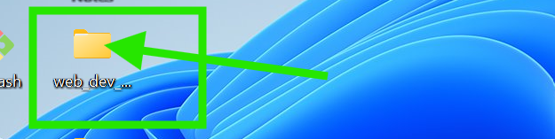
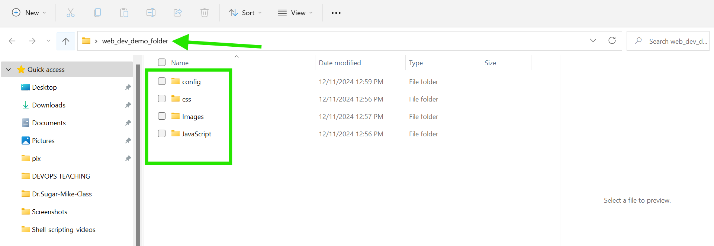
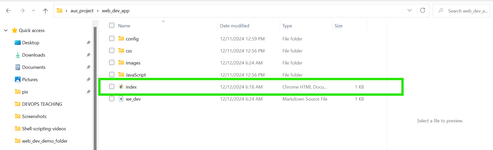
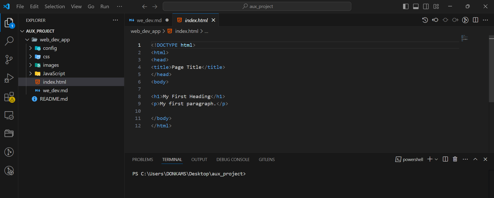
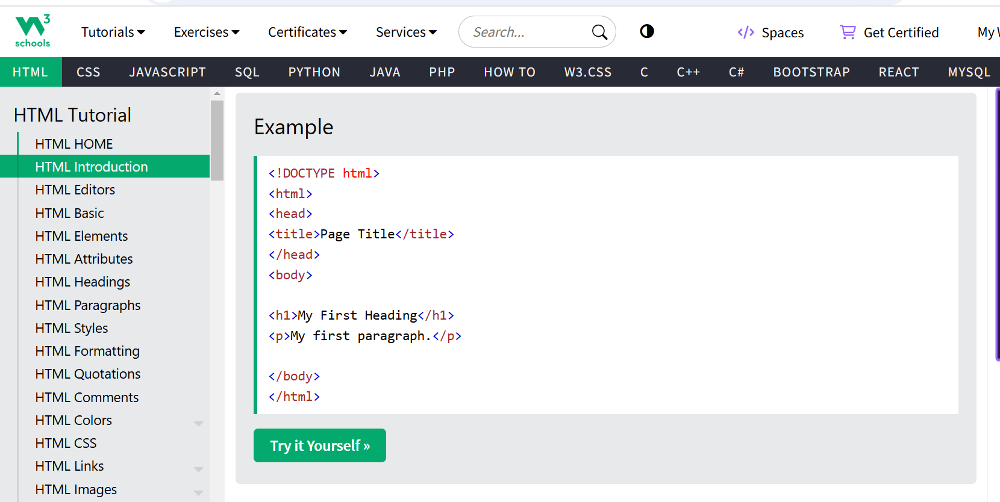
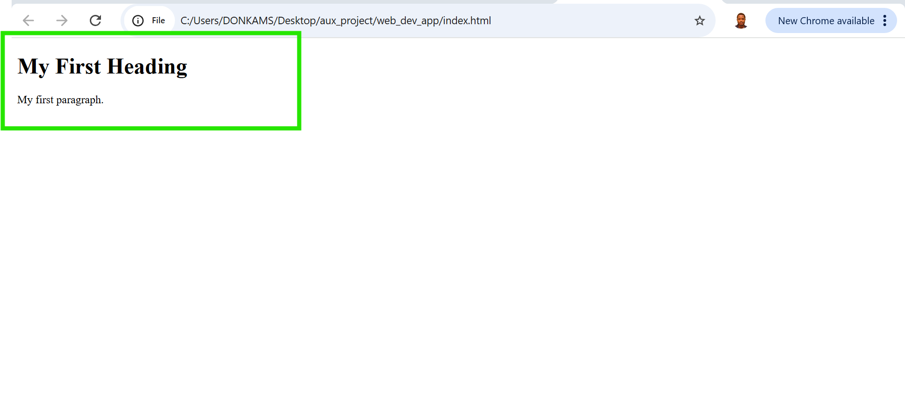

# Web Development and Programming Assignment.

1. Create a folder in any location on your computer computer (ex. Desktop, Documents)

The Image below shows the created web-dev folder on my Desktop computer.

2. Inside the folder, create three more folders and name them as follows: css, JavaScript, images, config.

`Below is the sub-config folders created inside the main folder.`

 

3. Inside the main folder, create a file called "index.html"

 
 

 4. Open the index.html file with your text editor e.g VS Code 

     `index.html file open on my VS code`

    

 5. Go to the above HTML tutorial link and copy the html basic structure and paste it on the index.   html file.  

6. Save the file and go to the main folder to double click the index.html file. This would open up your web browser to show the result of the code you have written 

*** the screenshot image of each step is attached***

